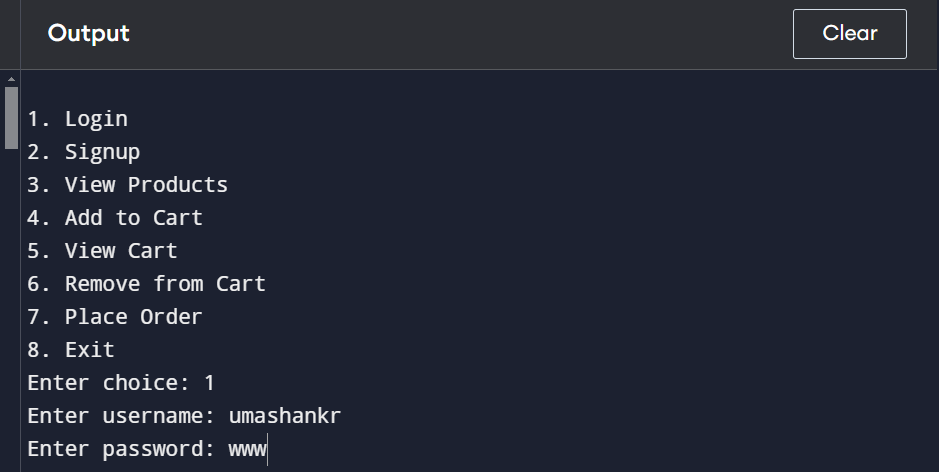

# Simple Shopping Cart System

This project is a simple command-line shopping cart system written in C. It allows users to sign up, log in, view a catalog of products, add products to the shopping cart, remove items from the cart, and place an order. The user authentication and product data are stored in text files.

## Features

- **User Authentication**: Users can sign up, log in, and authenticate with a username and password.
- **Product Catalog**: A list of products with names and prices that users can view and select from.
- **Shopping Cart**: Users can add items to their shopping cart, view the cart, remove items, and place an order.
- **Data Persistence**: User information and product details are saved and loaded from text files.

## Compilation & Setup

1. Clone the repository:
   ```bash
   git clone https://github.com/umashankar-11/simple-e-commerce-system-design-using-c-language/.git
   cd simple-e-commerce-system-design-using-c-language/
   ```

2. Compile the code using a C compiler (e.g., `gcc`):
   ```bash
   gcc -o main.c
   ```

3. Run the executable:
   ```bash
   ./main
   ```
   
## How It Works

1. **User Authentication**:
   - Users can sign up by providing a username and password. These credentials are saved in the `users.txt` file.
   - Users can log in with their credentials to access the shopping cart and other features.

2. **Product Catalog**:
   - The `products.txt` file contains the available products. Each line has a product name and its price.
   - Users can view the catalog of products and choose which items they want to add to their cart.

3. **Shopping Cart**:
   - Users can add products to their shopping cart with a specified quantity.
   - They can view the items in their cart, remove items, and view the total price.

4. **Placing an Order**:
   - Once the user is satisfied with the items in their cart, they can place the order. The cart is cleared after the order is placed.

## Menu Options

The program presents the following menu to users:

1. **Login**: Allows users to log in with their username and password.
2. **Signup**: Allows users to create a new account with a username and password.
3. **View Products**: Displays the list of available products along with their prices.
4. **Add to Cart**: Allows users to add a product to their shopping cart by selecting a product and specifying the quantity.
5. **View Cart**: Displays the current items in the shopping cart, including quantities and total price.
6. **Remove from Cart**: Allows users to remove a product from their shopping cart.
7. **Place Order**: Allows users to place their order and clears the cart.
8. **Exit**: Exits the program.

## Example Output

### User Menu:
```
1. Login
2. Signup
3. View Products
4. Add to Cart
5. View Cart
6. Remove from Cart
7. Place Order
8. Exit
Enter choice: 3
```

## Configuration

- **MAX_USERS**: Maximum number of users that can be registered. Default is `10`.
- **MAX_USERNAME_LEN**: Maximum length of a username. Default is `50`.
- **MAX_PASSWORD_LEN**: Maximum length of a password. Default is `50`.
- **MAX_PRODUCTS**: Maximum number of products available in the catalog. Default is `100`.
- **MAX_PRODUCT_NAME_LEN**: Maximum length of a product name. Default is `100`.
- **MAX_CART_ITEMS**: Maximum number of items that can be added to the shopping cart. Default is `10`.

You can modify these constants in the code to change the limits.


### OUTPUT


